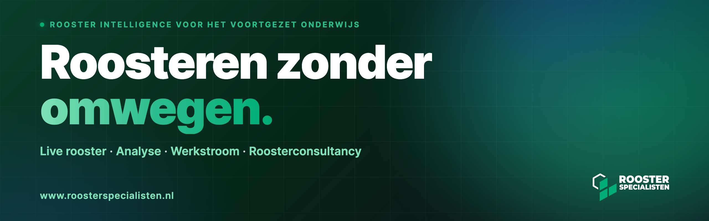

Roosterspecialisten maakt **Rooster Intelligence**: één dashboard voor scholen in het voortgezet onderwijs, direct uit het roostersysteem. Wij zijn zelf roostermakers en bouwen het dashboard dat wij elke dag gebruiken.

## Wat wij doen

| Onderdeel | Wat het doet |
|---|---|
| **Live rooster** | Dag- en weekroosters per docent, klas en lokaal, altijd actueel. |
| **Analyse** | Onderwijstijd, roosterkwaliteit, lessenverdeling, formatie en prognose, in rapporten met de huisstijl van de school. |
| **Werkstroom** | Verzoeken en roosteraanpassingen van aanvraag tot afhandeling, ouderavonden, jaarplanning en het roosterbord in de school. |
| **Roosterconsultancy** | Formatie-advies, voorbereiding op inspectie, fusietrajecten en second opinion, op locatie of op afstand. |

## Hoe wij met gegevens omgaan

- Wij lezen het roostersysteem van de school alleen uit; wij schrijven er niets in terug.
- Met elke school sluiten wij een verwerkersovereenkomst volgens het model van het Privacyconvenant Onderwijs. Daarin staat per onderdeel wat wij ophalen, waarvoor en hoe lang.
- Scholen zijn in het dashboard van elkaar gescheiden. Die scheiding wordt bij elke wijziging automatisch gecontroleerd.

Meer hierover staat op [roosterspecialisten.nl/privacy](https://www.roosterspecialisten.nl/privacy).

## Over deze pagina

De programmatuur van Rooster Intelligence staat in besloten repositories. Een beveiligingsprobleem melden kan via [info@roosterspecialisten.nl](mailto:info@roosterspecialisten.nl).

## Contact

[Website](https://www.roosterspecialisten.nl) · [Proefdraai plannen](https://www.roosterspecialisten.nl/proefdraai) · [Roosterconsultancy](https://www.roosterspecialisten.nl/roosterconsultant) · [LinkedIn](https://www.linkedin.com/in/roosterspecialisten) · 085 060 05 83

Roosterspecialisten B.V. · Hengelo (OV) · KvK 86733923
